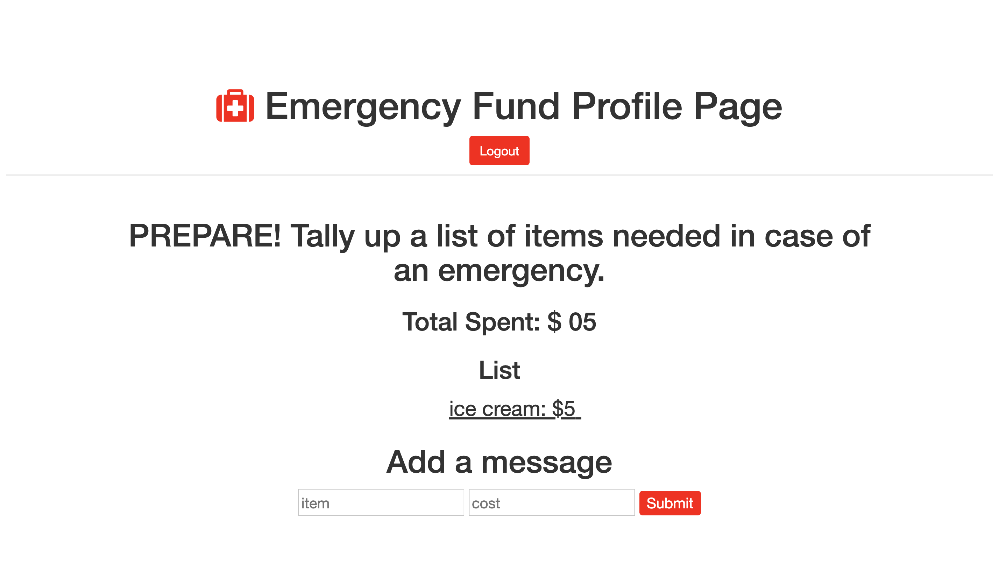

# ❗️Building an Emergency Prep List

### Development:
**Languages Used:**
HTML,CSS, Javascript, Node.js, MongoDB

Created a prep list that allows the user to tally each item's price and budget for what's needed in case of an emergency

### Optimizations:
I'd like to add an update functionality that allows the user to update each individual task and remove the items once completed.

## Installation:
1. Clone repo
2. run `npm install`

## Usage:
1. run `node server.js`
2. Navigate to `localhost:9090`
